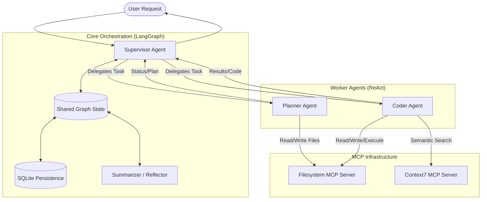

# Autotest

An Agentic AI for testing random code and write code agentically.

## Architecture & Design

This project implements a sophisticated **Supervisor-Worker** agentic workflow using **LangGraph** and **Groq**. The system is designed to autonomously analyze, plan and code software tasks.

### Core Components

The architecture consists of a central **Supervisor** that orchestrates specialized sub-agents:

1.  **Supervisor Agent** (`agent.supervisor`)
    *   **Role**: The project manager and orchestrator.
    *   **Responsibility**: Decomposes complex user requests into sub-tasks, delegates work to the correct sub-agent (`planner` or `coder`), monitors progress, and handles state handoffs.
    *   **Implementation**: Built using `langgraph_supervisor`.
    *   **Model**: Defaults to `llama-3.1-8b-instant` via Groq.
    *   **Memory**: Uses `AsyncSqliteSaver` (SQLite) for persistent state management and checkpointing.

2.  **Planner Agent** (`agent.planner`)
    *   **Role**: The strategic thinker.
    *   **Responsibility**: Creates detailed implementation plans, breaks down tasks, and manages the "todo" list.
    *   **Tooling**: Access to the filesystem via MCP (Model Context Protocol).
    *   **Type**: ReAct Agent.

3.  **Coder Agent** (`agent.coder`)
    *   **Role**: The executor and engineer.
    *   **Responsibility**: Writes code, executes commands, fixes errors, and implements the plans generated by the Planner.
    *   **Tooling**:
        *   **Filesystem MCP**: For reading/writing files and running commands (`npx @modelcontextprotocol/server-filesystem`).
        *   **Context7 MCP**: For query based context retrieval (`npx @upstash/context7-mcp`).
    *   **Type**: ReAct Agent with a specialized system prompt for code analysis and enhancement.

### Data Flow

### Key Features

*   **Model Context Protocol (MCP)**: The agents use MCP to standardize tool access (e.g., filesystem, external context).
*   **State Management**: Uses `SummaryState` to summarize past interactions and `AsyncSqliteSaver` to persist multiple global states for different chat sessions via unique thread IDs.
*   **Memory Handoffs**: Sub-agents manage task-specific memory by reading from and writing to the shared graph state, ensuring the Supervisor can transition between planning and coding without loss of context.
*   **Reflection**: The agents (especially Coder) are designed with a "reflection" loop to analyze their own work and correct errors before finishing.
*   **Pre-Model Hooks**: A `summarization_node` runs before model calls to optimize context window usage.

### Directory Structure

*   `agent/src/agent/supervisor`: Main entry point and orchestration logic.
*   `agent/src/agent/planner`: Planner agent definition and tools.
*   `agent/src/agent/coder`: Coder agent definition and tools.
*   `agent/src/agent/tools`: Shared tool definitions (legacy/utility).
*   `agent/src/agent/models.py`: LLM configurations (Groq, OpenAI, etc.).
*   `agent/src/agent/settings.py`: Configuration and environment variables.

